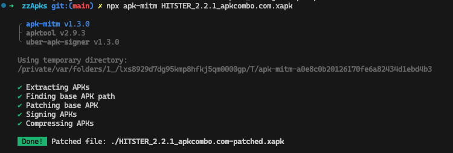

# QR code decoding

The code extracted from the sample QR is www.hitstergame.com/nl/00180

# First approach (set aside): decompile with jadx-gui

- Download the several APKs from the device:

```
adb pull /data/app/~~yqdXo4E-w4iwwqr8REfzyg==/nl.jumbo.hitster-hx_Jtxl7T3auW5PbO8gFOQ==/base.apk
adb pull /data/app/~~yqdXo4E-w4iwwqr8REfzyg==/nl.jumbo.hitster-hx_Jtxl7T3auW5PbO8gFOQ==/split_config.arm64_v8a.apk
adb pull /data/app/~~yqdXo4E-w4iwwqr8REfzyg==/nl.jumbo.hitster-hx_Jtxl7T3auW5PbO8gFOQ==/split_config.en.apk
adb pull /data/app/~~yqdXo4E-w4iwwqr8REfzyg==/nl.jumbo.hitster-hx_Jtxl7T3auW5PbO8gFOQ==/split_config.nl.apk
adb pull /data/app/~~yqdXo4E-w4iwwqr8REfzyg==/nl.jumbo.hitster-hx_Jtxl7T3auW5PbO8gFOQ==/split_config.xxhdpi.apk
```

Run `jadx-gui`:

```
jadx-gui base.apk
```

See that there's a file called `Resources/assets/index.android.bundle`. That's the whole React Native app.

Now extract the whole thing with `apktool`:

```
apktool d -f base.apk
```

Then locate the decompiled `index.android.bundle` from `Resources/assets`.

Run `file index.android.bundle` on it. Result:

```
index.android.bundle: Hermes JavaScript bytecode, version 96
```

## Next steps (NOT DONE!)

Try and decompile the Hermes binary -- see https://labs.cognisys.group/posts/How-to-Decompile-Hermes-React-Native-Binary/.

# MITMProxy

## On the Mac

- Install MITMProxy on Mac `brew install mitmproxy`
- Start `mitmweb` and it will start a proxy at localhost:8080 and a web interface at localhost:8081

## On the Android device

### Set up the proxy

- Open the Wi-Fi connection, click the cog icon, click the pencil icon, go to Advanced options
- Select "Use manual proxy" at address (currently) `192.168.2.43` and port `8080`

### Download the root cert

This only works if the proxy is active:

- On the mobile browser go to http://mitm.it
- Select the root cert for Android and download it
- Then under Settings -> "Encryption & credentials" go to "Install a certificate" and select the file downloaded in the previous step.

### Connect Hitster to Spotify

- Turn off Wi-Fi (use mobile data) for this step
- Kill & restart Hitster
- Do the "connect with Spotify" step
- Now reactivate Wi-Fi
- Scan the QR code <-- THIS WILL NOT GO THROUGH THE PROXY because it doesnt trust the "User" root cert

  - See mitmproxy's output on console: `Client TLS handshake failed. The client does not trust the proxy's certificate for gew4-dealer.spotify.com`

- TODO: try again with patched XAPK

# Strip cert pinning from APK (NOT COMPLETED YET)

- Go to https://apkcombo.com/hitster/nl.jumbo.hitster/download/apk and download the latest XAPK (app bundle)
- Now install [apk-mitm](https://github.com/niklashigi/apk-mitm):

```
npm install --save-dev apk-mitm
```

- Run the tool on the downloaded XAPK:

```
npx apk-mitm HITSTER_2.2.1_apkcombo.com.xapk
```

Result:



## Next steps (TODO!)

- Take `HITSTER_2.2.1_apkcombo.com-patched.xapk` and (sign it? and) install it with `adb install` or follow any pointers at https://github.com/niklashigi/apk-mitm.
- Try again with the proxy on
